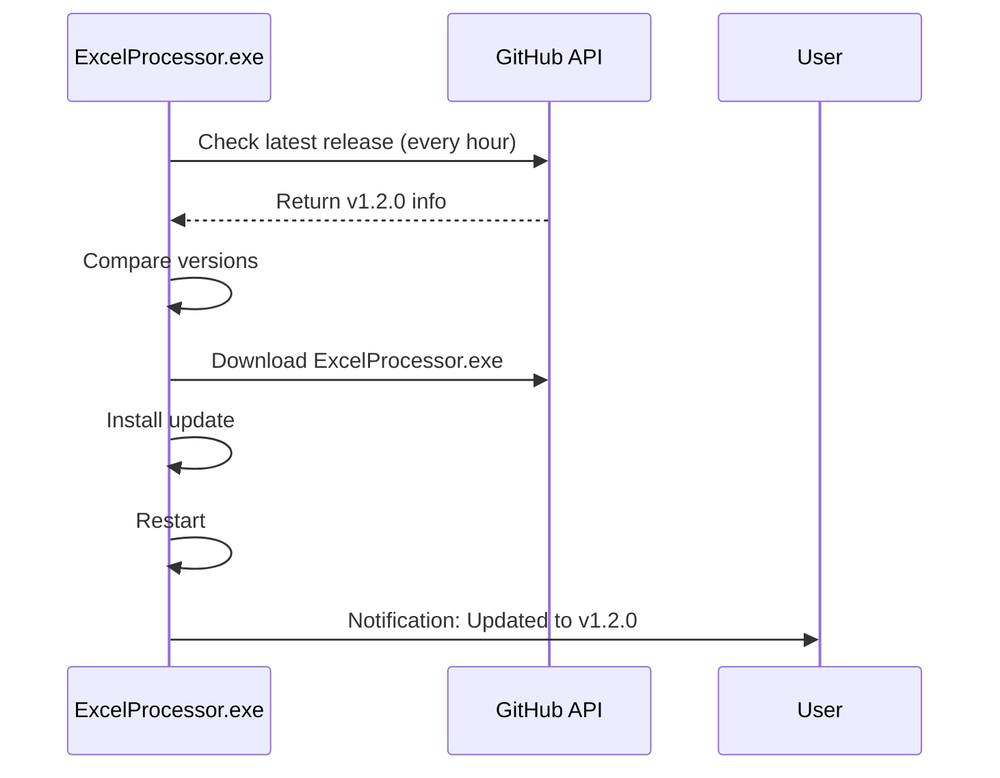

# Excel Processor - Deployment Guide

This guide explains how to build and deploy the Excel Processor application as a standalone executable with automatic update capabilities.

## Table of Contents
- [Prerequisites](#prerequisites)
- [Local Build](#local-build)
- [Creating a Release](#creating-a-release)
- [Auto-Update Mechanism](#auto-update-mechanism)
- [Troubleshooting](#troubleshooting)

## Prerequisites

### For Local Build
- Python 3.11 or later
- Windows 10 or later
- Administrator privileges (for some operations)

### For GitHub Releases
- GitHub account with push access to `Andrew-0807/ExcelProcessor`
- GitHub Actions enabled for the repository

## Local Build

### Step 1: Install Dependencies
```bash
pip install -r requirements.txt
pip install pyinstaller
```

### Step 2: Run the Build Script
```bash
python build.py
```

The build script will:
1. Check all dependencies
2. Clean previous build artifacts
3. Build the executable with PyInstaller
4. Verify the build
5. Create build information

### Step 3: Test the Executable
Navigate to the `dist/` directory and run `ExcelProcessor.exe`:
```bash
cd dist
ExcelProcessor.exe
```

The application should:
- Start a local web server on port 5000
- Open your default browser
- Show a system tray icon

### Build Output
After a successful build, you'll find:
- `dist/ExcelProcessor.exe` - The standalone executable
- `dist/BUILD_INFO.txt` - Build metadata

## Creating a Release

### Method 1: Using Git Tags (Recommended)

1. **Update the version** in [`app_info.py`](app_info.py:8):
   ```python
   __version__ = "1.2.0"
   ```

2. **Commit the changes**:
   ```bash
   git add app_info.py
   git commit -m "Bump version to 1.2.0"
   ```

3. **Create and push a tag**:
   ```bash
   git tag v1.2.0
   git push origin main
   git push origin v1.2.0
   ```

4. **GitHub Actions will automatically**:
   - Build the executable
   - Create a GitHub release
   - Upload the `.exe` file

### Method 2: Manual GitHub Actions Trigger

1. Go to the **Actions** tab in your GitHub repository
2. Select **Build and Release** workflow
3. Click **Run workflow**
4. Enter the version (e.g., `v1.2.0`)
5. Click **Run workflow**

### Method 3: Manual Release Creation

1. **Build locally**:
   ```bash
   python build.py
   ```

2. **Create a GitHub release**:
   - Go to the **Releases** page
   - Click **Draft a new release**
   - Enter tag version (e.g., `v1.2.0`)
   - Upload `dist/ExcelProcessor.exe`
   - Add release notes (see [`release_notes/v1.2.0.md`](release_notes/v1.2.0.md:1))
   - Click **Publish release**

## Auto-Update Mechanism

### How It Works

The auto-update system uses GitHub Releases to distribute updates:



### Update Configuration

Update settings are in [`app_info.py`](app_info.py:1):

```python
APP_NAME = "Excel Processor"
REPO_OWNER = "Andrew-0807"
REPO_NAME = "ExcelProcessor"
RELEASE_ASSET_NAME = "ExcelProcessor.exe"
UPDATE_CHECK_INTERVAL = 60 * 60  # seconds (1 hour)
```

### Pushing Updates

To push an update to all users:

1. Make your code changes
2. Update `__version__` in [`app_info.py`](app_info.py:8)
3. Commit and push with a version tag:
   ```bash
   git add .
   git commit -m "Your commit message"
   git tag v1.3.0
   git push origin main
   git push origin v1.3.0
   ```

4. GitHub Actions builds and creates the release
5. All running instances of the app will automatically:
   - Detect the new version
   - Download the update
   - Install and restart

## Troubleshooting

### Build Issues

**Problem**: PyInstaller fails with import errors

**Solution**: Add missing modules to `hiddenimports` in [`excel_processor.spec`](excel_processor.spec:1):
```python
hiddenimports=[
    'pandas',
    'openpyxl',
    # ... add missing modules here
]
```

**Problem**: Executable is too large

**Solution**: Add more packages to `excludes` in [`excel_processor.spec`](excel_processor.spec:1):
```python
excludes=['torch', 'tensorflow', 'matplotlib', 'scipy', ...]
```

### Runtime Issues

**Problem**: App won't start

**Solutions**:
- Check Windows Defender isn't blocking the executable
- Run as administrator
- Verify port 5000 isn't already in use
- Check `__pycache__` directories are cleaned

**Problem**: Processing modules not found

**Solution**: Ensure data directories are included in the spec file:
```python
datas=[
    ('templates', 'templates'),
    ('static', 'static'),
    ('borderou', 'borderou'),
    ('CardCec', 'CardCec'),
    ('classes', 'classes'),
]
```

### Update Issues

**Problem**: Updates not downloading

**Solutions**:
- Check internet connection
- Verify GitHub is accessible
- Ensure the release tag follows `vX.Y.Z` format
- Check that `RELEASE_ASSET_NAME` matches the uploaded file

**Problem**: Update installation fails

**Solutions**:
- Ensure the app is running as a frozen executable (not from source)
- Check file permissions
- Verify the update script can write to the executable location

## CI/CD Pipeline

The GitHub Actions workflow (`.github/workflows/release.yml`) automatically:

1. **On tag push** (`v*.*.*`):
   - Checks out the code
   - Sets up Python 3.11
   - Installs dependencies
   - Builds the executable
   - Creates a GitHub release with the `.exe` file

2. **Manual trigger**:
   - Allows building any version without pushing a tag

## Security Considerations

### Code Signing
The current executable is not code-signed. Users may see Windows SmartScreen warnings. To fix this:

1. Obtain a code signing certificate
2. Sign the executable:
   ```bash
   signtool sign /f certificate.pfx /p password /t http://timestamp.digicert.com dist/ExcelProcessor.exe
   ```

### Update Verification
The auto-update system:
- Downloads from official GitHub Releases
- Verifies the asset name matches `RELEASE_ASSET_NAME`
- Uses HTTPS for all communications

## Performance Optimization

### Build Time
- Initial build: ~2-5 minutes
- Incremental builds: ~1-2 minutes

### Executable Size
- Typical size: 50-80 MB
- Can be reduced by excluding unused packages

### Startup Time
- First launch: 3-5 seconds
- Subsequent launches: 2-3 seconds

## Additional Resources

- [PyInstaller Documentation](https://pyinstaller.org/)
- [GitHub Actions Documentation](https://docs.github.com/en/actions)
- [Release Notes Template](release_notes/v1.2.0.md)
- [Architecture Plan](plans/standalone-app-with-autoupdate.md)

## Support

For issues or questions:
- Create an issue on GitHub
- Check existing issues for solutions
- Review the troubleshooting section above
