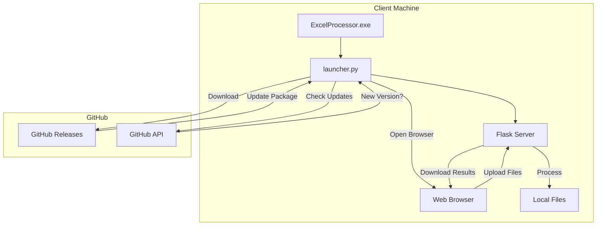
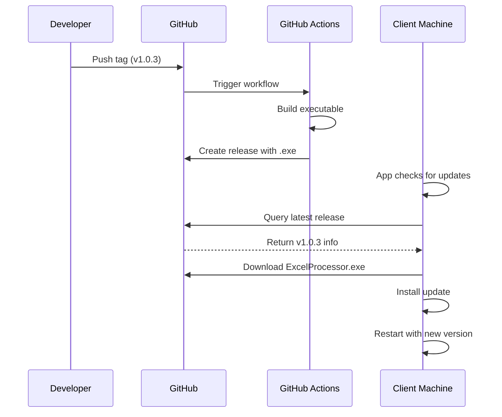

# Standalone Application with Auto-Updates Plan

## Overview

This document outlines the plan to convert the Excel Processor application into a standalone executable that runs locally on client machines with automatic remote update capabilities.

## Current State Analysis

### What's Already Implemented
- ✅ Flask web server running on localhost (files processed on client PC)
- ✅ Auto-update system checking GitHub releases ([`auto_update.py`](../auto_update.py))
- ✅ System tray launcher application ([`launcher.py`](../launcher.py))
- ✅ PyInstaller spec file exists ([`excel_processor.spec`](../excel_processor.spec))
- ✅ GitHub repository configured (Andrew-0807/ExcelProcessor)

### Architecture Overview



## Required Changes

### 1. Update PyInstaller Spec File

The current [`excel_processor.spec`](../excel_processor.spec) needs updates to include:

- **Hidden imports** for pandas, openpyxl, and other dependencies
- **Data directories**: `borderou/`, `CardCec/`, `classes/`
- **Python modules** that are imported dynamically

**Changes needed:**
```python
# Add to hiddenimports:
hiddenimports=[
    'pandas',
    'openpyxl',
    'openpyxl.cell._writer',
    'openpyxl.styles',
    'werkzeug.serving',
    'pystray',
    'PIL',
    'requests',
    'packaging',
    'borderou.main',
    'CardCec.pos_processor',
    'classes.valoare_sgr',
    'classes.valoare_minus',
    'classes.format_add_column',
    'classes.excel_data_extractor',
],

# Add to datas:
datas=[
    ('templates', 'templates'),
    ('static', 'static'),
    ('borderou', 'borderou'),
    ('CardCec', 'CardCec'),
    ('classes', 'classes'),
],
```

### 2. Create Build Script

Create [`build.py`](../build.py) to automate the build process:

```python
#!/usr/bin/env python3
"""
Build script for creating standalone ExcelProcessor executable.
"""
import subprocess
import sys
from pathlib import Path

def clean_build():
    """Remove previous build artifacts."""
    for dir_name in ['build', 'dist']:
        Path(dir_name).mkdir(exist_ok=True)
        subprocess.run(['rmdir', '/s', '/q', dir_name], shell=True)

def build_exe():
    """Build the executable using PyInstaller."""
    subprocess.run([
        sys.executable, '-m', 'PyInstaller',
        '--clean',
        'excel_processor.spec'
    ], check=True)

def main():
    print("Building ExcelProcessor...")
    clean_build()
    build_exe()
    print(f"Build complete! Executable available in dist/")

if __name__ == '__main__':
    main()
```

### 3. GitHub Actions Workflow

Create `.github/workflows/release.yml` for automated builds:

```yaml
name: Build and Release

on:
  push:
    tags:
      - 'v*.*.*'
  workflow_dispatch:

jobs:
  build:
    runs-on: windows-latest
    
    steps:
      - uses: actions/checkout@v4
      
      - name: Set up Python
        uses: actions/setup-python@v4
        with:
          python-version: '3.11'
      
      - name: Install dependencies
        run: |
          python -m pip install --upgrade pip
          pip install -r requirements.txt
          pip install pyinstaller
      
      - name: Build executable
        run: python build.py
      
      - name: Create release
        uses: softprops/action-gh-release@v1
        with:
          files: dist/ExcelProcessor.exe
          generate_release_notes: true
        env:
          GITHUB_TOKEN: ${{ secrets.GITHUB_TOKEN }}
```

### 4. Update Release Notes Template

Update [`release_notes/v1.0.3.md`](../release_notes/v1.0.3.md) template:

```markdown
# Release v1.0.3

## What's New
- Standalone executable with auto-update capability
- All processing modules bundled (Borderou, CardCec, Classes)
- System tray application for easy access

## Improvements
- Improved update mechanism with progress tracking
- Better error handling and user notifications

## Installation
1. Download `ExcelProcessor.exe`
2. Run the executable
3. The app will automatically check for updates on startup

## Technical Details
- Built with PyInstaller
- Auto-updates via GitHub Releases
- All processing happens locally on your machine
```

### 5. Test Build and Update Mechanism

Testing checklist:
- [ ] Build executable locally
- [ ] Run executable and verify all features work
- [ ] Verify system tray functionality
- [ ] Test file processing (all modes: adaos, sgr, minus, extract, borderou, cardcec)
- [ ] Test manual update check
- [ ] Test auto-update on startup
- [ ] Verify update installation and restart

## Deployment Workflow



## File Structure After Changes

```
Trae - MomAutomations/
├── .github/
│   └── workflows/
│       └── release.yml          # NEW: Automated build workflow
├── build.py                     # NEW: Build script
├── excel_processor.spec         # UPDATED: Include all modules
├── launcher.py                   # Existing
├── server.py                     # Existing
├── auto_update.py                # Existing
├── app_info.py                   # Existing
├── requirements.txt              # Existing
├── borderou/                     # Existing - will be bundled
├── CardCec/                      # Existing - will be bundled
├── classes/                      # Existing - will be bundled
├── templates/                    # Existing - will be bundled
├── static/                       # Existing - will be bundled
└── plans/
    └── standalone-app-with-autoupdate.md  # This file
```

## Implementation Order

1. **Update PyInstaller spec** - Include all required modules and data directories
2. **Create build script** - Automate local builds
3. **Test local build** - Verify everything works
4. **Set up GitHub Actions** - Automated CI/CD pipeline
5. **Create first release** - Test the complete update flow
6. **Document deployment process** - Instructions for future updates

## Notes

- The auto-update system is already implemented and should work once releases are set up
- All file processing happens locally on the client's machine - no server hosting required
- The Flask server runs on localhost (127.0.0.1:5000) within the packaged app
- Updates are pushed by creating new GitHub releases with version tags (e.g., v1.0.3)
